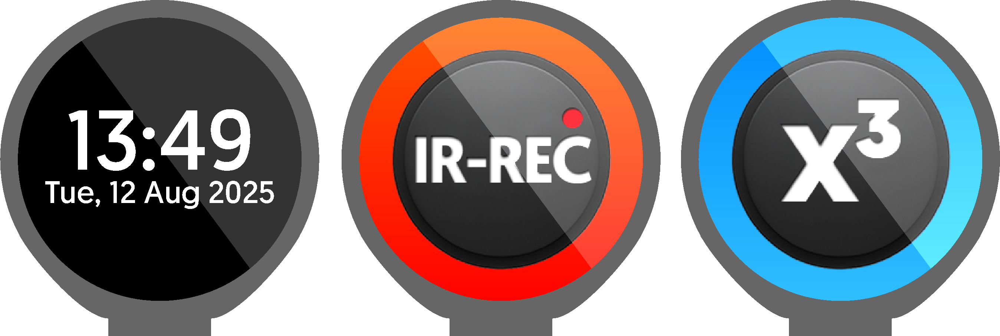
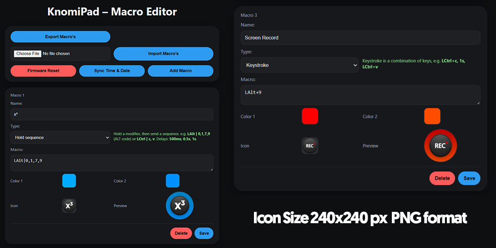

# KnomiPad — Turn Your BTT Knomi V2 into a Mini Stream Deck 🎛️

  

KnomiPad is custom firmware that transforms the **BIGTREETECH Knomi V2** into a sleek, swipeable **Bluetooth® HID macropad** with a built-in, mobile-friendly **web editor**. Create keys, assign actions, upload icons, pick colors (with gradients), and swipe between pages — plus a clean **Home screen clock**. 
I came up with the idea while thinking the knomi is such a cool little screen, there has to be more use cases for it, and thus this was born.
This firmware is very early days but I found myself not having much time, it works for my use case, but I encourage everyone to modify and fix the code where needed and submit a pull request!

I am sure this firmware can be ported quite easily to the Waveshare ESP OLED screens too.

I want to Implement a "Widget" upload section eventually too so users can code widgets seperately from the main firmware and upload them.

Unfortunately due to HID limitations it cant be used stand alone to open shortcuts, but you can easily set up a app on your PC that gives app shortcuts key binds and that way you can launch applications too.

---

## Highlights 🚀

- **BLE Keyboard/HID** — Works with Windows, macOS, and Linux.  
- **Swipeable pages** — Switch between macro layouts with left/right swipes (and a Home clock).  
- **Web editor** — Visit **`http://knomipad.local`** to add keys, upload PNG icons, and choose colors. 🌐  
- **Import/Export** — Save and share your layouts. 💾  
- **Factory Reset** — One click to restore defaults (clears Wi-Fi, icons, and macros). 🔄

---

## Quick Start ⚡

1) **Install VS Code + PlatformIO**  
   See **[Flashing with VS Code & PlatformIO](docs/Flashing.md)**.

2) **Flash the firmware** to your Knomi V2 (ESP32-S3). After boot, you should see the Home clock.  
3) **Connect to Wi-Fi**  
   - First boot starts an AP named **`KnomiPad`**.  
   - Join it, browse to **`http://knomipad.local`**, and select your home Wi-Fi.  
   - The device reboots and joins your network. See **[First-Time Setup & Wi-Fi](docs/Setup.md)**.  
4) **Open the Web Editor** at **`http://knomipad.local`** to add macros, upload icons (PNG), and pick gradient colors.  
5) **Pair over Bluetooth** — Pair **“KnomiPad”** with your computer/phone. If pairing flaps, forget & re-pair. See **[Troubleshooting](docs/Troubleshooting.md)**.

---

## Web Editor Overview 🧩

The home page is split into three blocks:

- **Export / Import** — Save or load your layout (`.json`).  
- **System Tools** —  
  - **Sync Time & Date** (updates the Home clock),  
  - **Firmware Reset** (clears macros, icons **and Wi-Fi**; reboots),  
  - **Add Macro** (creates a new macro card).  
- **Macro Cards** — Name, Type (with helper text), Macro, Background (Color 1 & Color 2), Icon (PNG), Preview, **Save** / **Delete**.

> **Tip:** Want a solid color? Set **Color 1 == Color 2**.

---

## Macro Types (No Coding Needed) ⌨️

1) **Keystroke**  
   Send key **chords** and **pauses** in sequence.  
   _Examples:_ `LCtrl+c, 1s, LCtrl+v` • `F12` • `LShift+a, 500ms, LShift+b`

2) **Typing**  
   Types the characters you write (optional per-character speed).  
   _Examples:_ `Hello world` • `secret (10/s)`

3) **Keybind**  
   Bind a single key to the button.  
   _Examples:_ `F5` • `Tab` • `Enter`

4) **Hold Sequence** *(great for Windows ALT codes)*  
   Hold a modifier (or chord), then send a list of keys/delays.  
   **Pattern:** `<Hold> | <sequence>`  
   _Examples:_ `LAlt | 0,1,7,9` → sends **ALT+0179** • `LCtrl | c, 500ms, v`  
   > When **Alt** is held, digits go through the **keypad**. If NumLock is off, KnomiPad enables it temporarily and restores it afterwards.

---

## Supported Keys (Quick Reference) 🧾

- **Modifiers:** `L/R Ctrl`, `L/R Shift`, `L/R Alt`, `L/R Gui` (Win/Cmd)  
- **Function:** `F1`–`F24`  
- **Navigation:** `Home`, `End`, `PageUp`, `PageDown`  
- **Arrows:** `Up`, `Down`, `Left`, `Right`  
- **Editing:** `Tab`, `Enter`/`Return`, `Escape`, `Backspace`, `Delete`  
- **Letters & Numbers:** `a`–`z`, `A`–`Z`, `0`–`9`

---

## On-Device UI 🖥️

- **Home Clock** — white-on-black, blinking colon.  
- **Pages** — swipe left/right between macro pages.  
- **Tap Feedback** — tiny white dot appears on press.  
- **Icons** — PNG (200–240 px recommended). The device auto-centers/scales.

---

## Docs & Links 🔗

- **Flashing guide** → [docs/Flashing.md](docs/Flashing.md)  
- **First-time setup & Wi-Fi** → [docs/Setup.md](docs/Setup.md)  
- **Creating Macros** → [docs/Macros.md](docs/Macros.md)  
- **Troubleshooting** → [docs/Troubleshooting.md](docs/Troubleshooting.md)

---

Made by **Apex Invent** (Basilisk). 🐍
